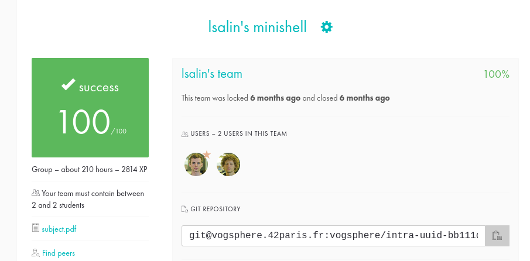

# Minishell

🇫🇷

L'objectif du projet Minishell est simple : créer un shell minimaliste personnalisé qui imite les fonctionnalités de base du shell Bash.

Le code doit respecter la Norme imposée par 42 (voir pdf).

__Fonctionnalités à implémenter__ :

* Afficher un prompt pour l'entrée de commande.
* Gérer l'historique des commandes (flèche du haut et flèche du bas).
* Exécutables système disponibles depuis l'environnement (`ls`, `cat`, `grep`, etc.)
* Rechercher et exécuter le bon exécutable (en se basant sur la variable d'environnement PATH, ou sur un chemin relatif ou absolu).
* Gérer les guillemets simples et doubles pour interpréter les méta-caractères.
* Implémenter les redirections d'entrée et de sortie (`<`, `>`, `<<`, `>>`).
* Implémenter les pipes (`|`).
* Gérer les variables d'environnement et leur substitution dans les commandes.
* Gérer le code de sortie de la dernière commande exécutée (`$?`).
* Gérer les signaux `ctrl-C`, `ctrl-D` et `ctrl-\`.
* Implémenter les commandes intégrées suivantes : `echo`, `cd`, `pwd`, `export`, `unset`, `env` et `exit`.

__Comment tester le projet__ ?
* `make` a la racine, puis `./minishell`
* Vous êtes maintenant dans notre shell personnalisé, amusez-vous avec des commandes et comparez le comportement avec Bash !

🇺🇸

The goal of the Minishell project is simple: to create a custom minimalist shell that mimics the basic functionality of the Bash shell.

The code must respect the Norm imposed by 42 (see pdf).

__Features to implement__:

* Display a prompt for command entry.
* Manage order history (up and down arrows).
* System executables available from the environment (`ls`, `cat`, `grep`, etc.)
* Find and run the correct executable (based on the PATH environment variable, or on a relative or absolute path).
* Handle single and double quotes to interpret metacharacters.
* Implement input and output redirections (`<`, `>`, `<<`, `>>`).
* Implement pipes (`|`).
* Manage environment variables and their substitution in commands.
* Handle the exit code of the last executed command (`$?`).
* Handle `ctrl-C`, `ctrl-D` and `ctrl-\` signals.
* Implement the following built-in commands: `echo`, `cd`, `pwd`, `export`, `unset`, `env` and `exit`.

__How to test the project__?

* `make` at root, then `./minishell`
* You are now in our custom shell, have fun with commands and compare behavior with Bash!

